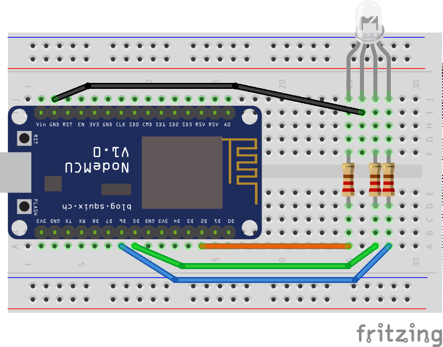

# RGB-Led

This is a quick example of how to use websockets in an ESP8266 device. 

The websocket server is runs the NodeMCU and its code is based on one of the examples provided in the arduinoWebsocket project. The client is a QML application that can be executed in a desktop PC or a smartphone.

## Requirements

- This source uses Arduino IDE and its standard libraries
- Additional libraries: arduinoWebsocket
- QT creator IDE for the client application

## Hardware components

- NodeMCU 0.9/1.0
- An RGB Led
- A computer or smartphone to run the client application

## Description

I wanted to experiment with websockets and this was a simple way to do it. The arduino code is very similar to what you can find in this [example](https://github.com/Links2004/arduinoWebSockets/blob/master/examples/WebSocketServer_LEDcontrol/WebSocketServer_LEDcontrol.ino).
On the other side, the client is a Qt (QML) application. I think QML is an easy way of developing smartphone applications and the advantadge is that you can use the same code in a desktop PC.

The Qt application shows a color picker that sends the current RGB color value through a websocket to the NodeMC device so, you can see how the colors change as you move your finger on the screen.

The circuit is very simple and can be found in other projects on the web.

 

I use three 220 ohm resistors but it is preferable to use different values according to the information of the RGB led specifications. You can read about this for instance [here](http://forums.netduino.com/index.php?/topic/8060-resistor-value-for-rgb-led/#entry44769)

Because of that, the colors I get are not very accurate, It works well with red, green, blue amd magenta but as an example, I couldn't get yellow.

When the code is executed the led shows a red color while the WiFi access point is set. Then, when is ready, the led turns into green. Due to the NodeMCU works as an AP,it is necessary to connect to that wireless network fron the smartphone (or the computer). The dafault data is the following:

- SSID: ESP8266-RGB
- Password: rgb12345

After connecting, the green color will change. The RGB code selected in the color picker is transmitted through the websocket to the NodeMCU. After that, the code is split and each of the red, green and blue values are converted to an integer and sent to the corresponding PWM pin. 

Another option is to launch in a web browser the html client using this URL http://esp8266.local (if this doesn't work try http://192.168.4.1). You will se three sliders corresponding with the RGB values. Just change them and you will see the new color in your led.
